## SERIRALIZATION PROCESS

0 - Complete flow chart working of serilizer - 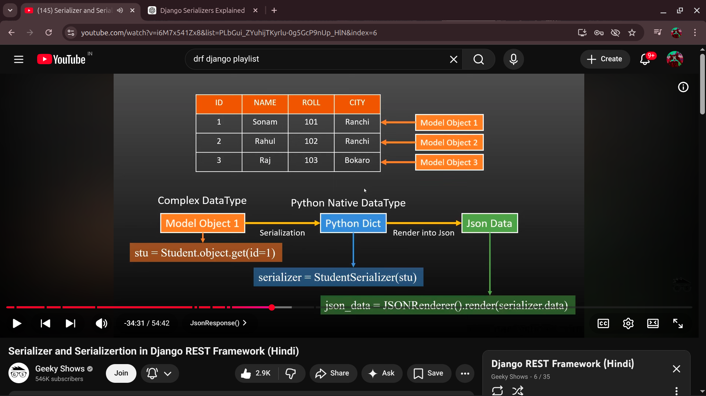

1 - 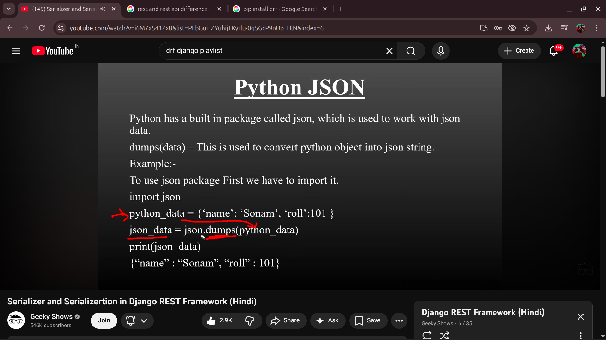

2 - 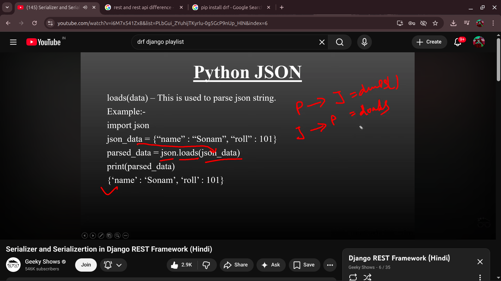

3- 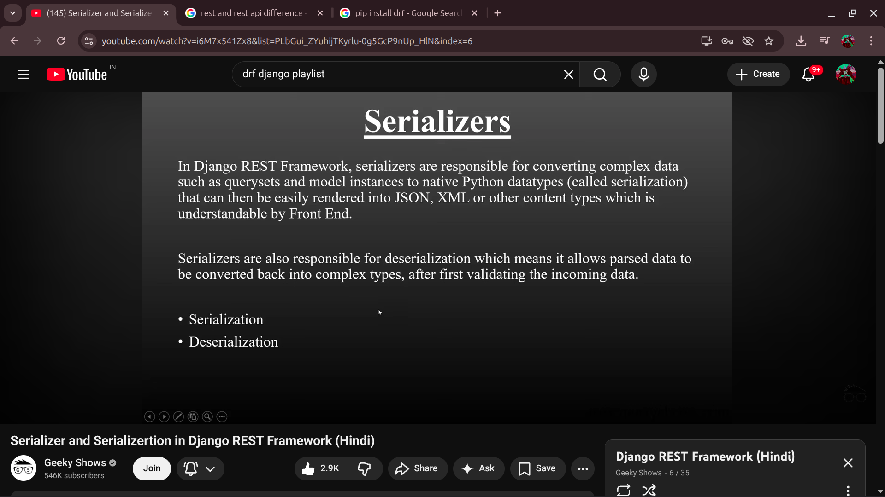

4 - 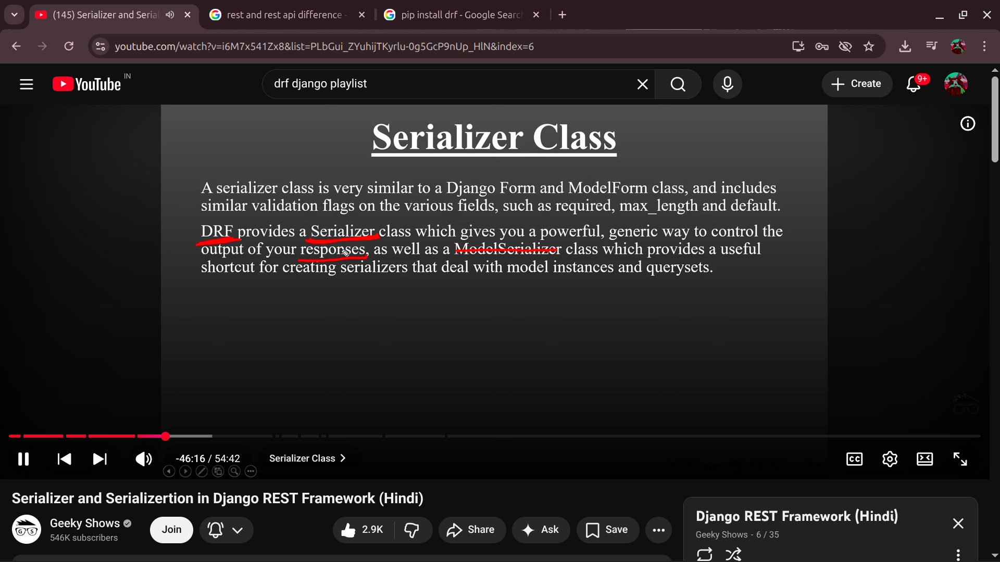

5 - 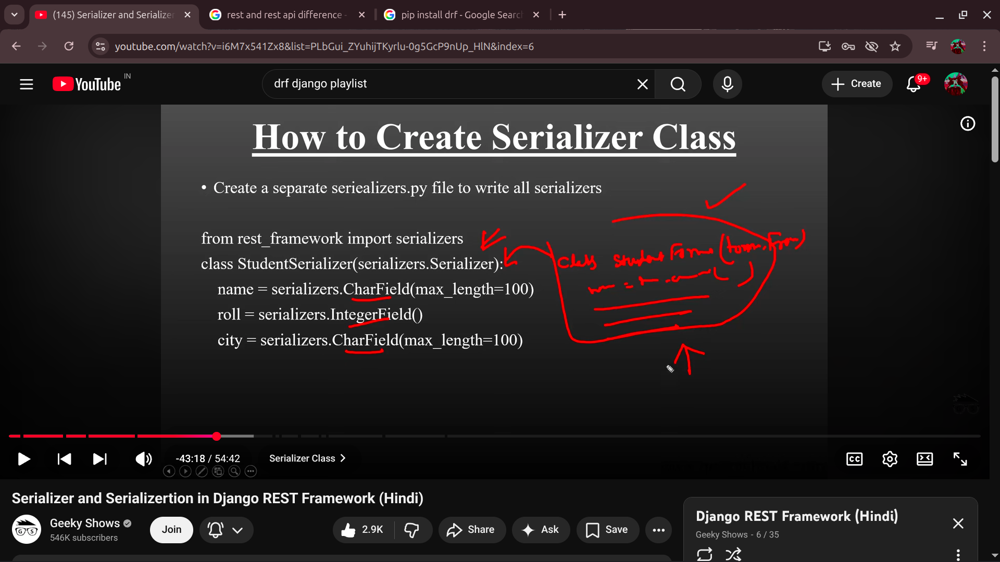

6 - 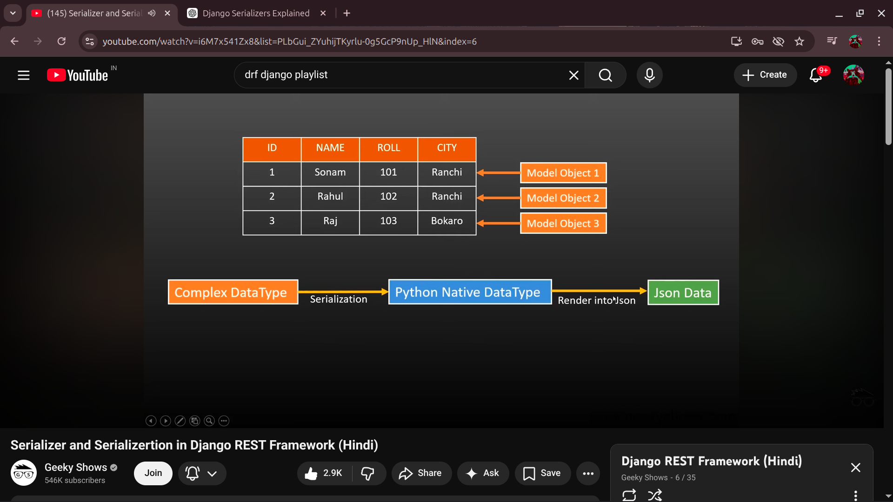

7 - Serilization -- 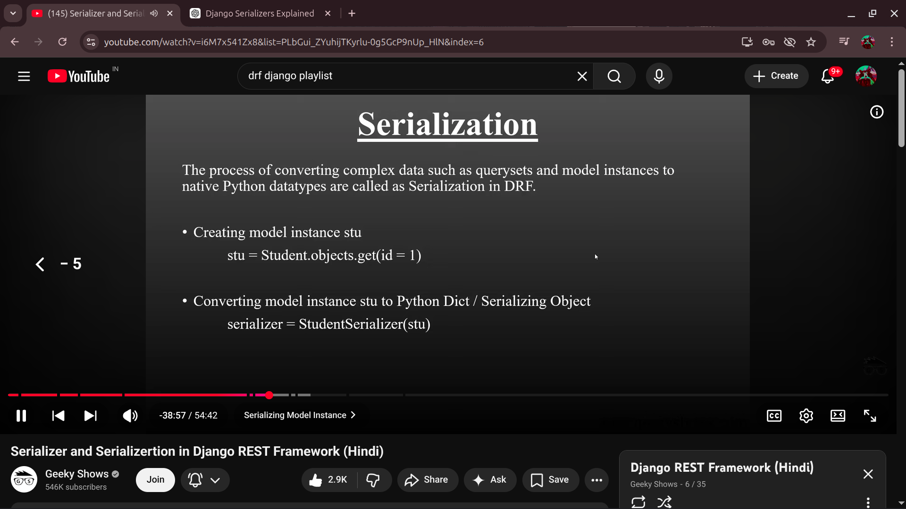 and 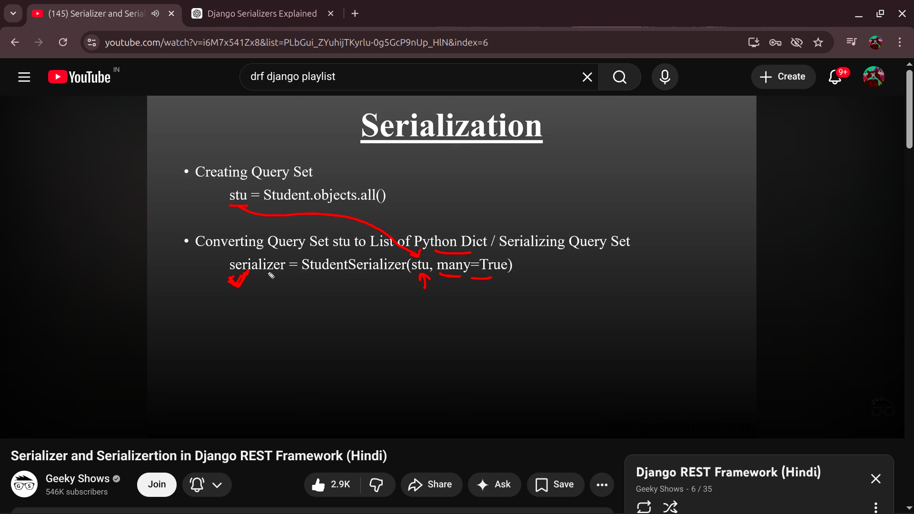

8-  now to convert serilized data( i.e python converted data type from queryset or objects) to json we call( i.e called json rendering) --- 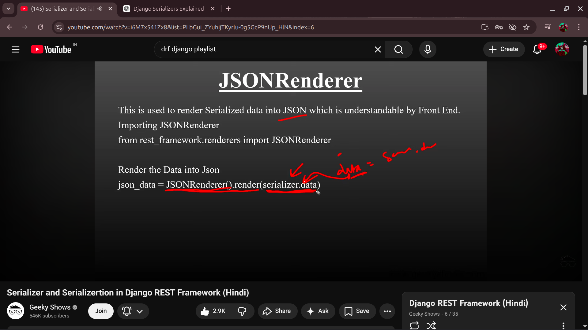

9- optional but important (JSON RESPONSE) -- 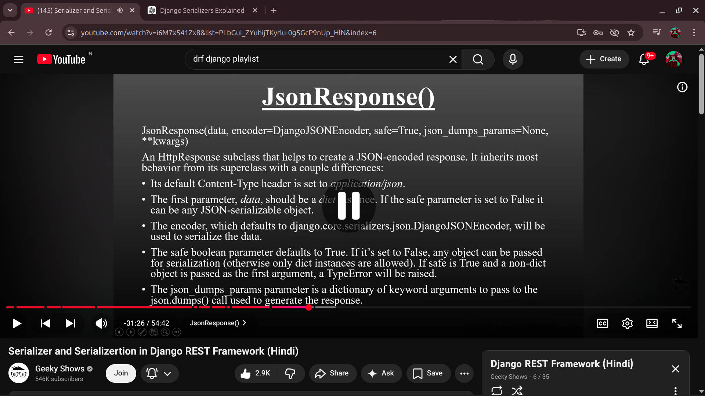

## DESERIALIZATION PROCESS

0 - entir flow chart-- 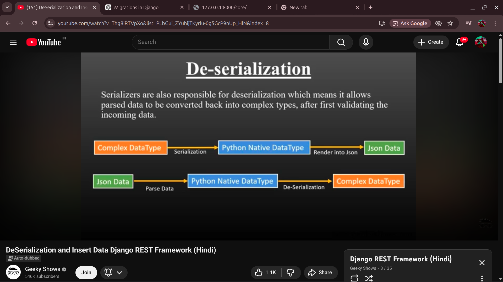

1- bytesio --  

2 - jsonparser -- 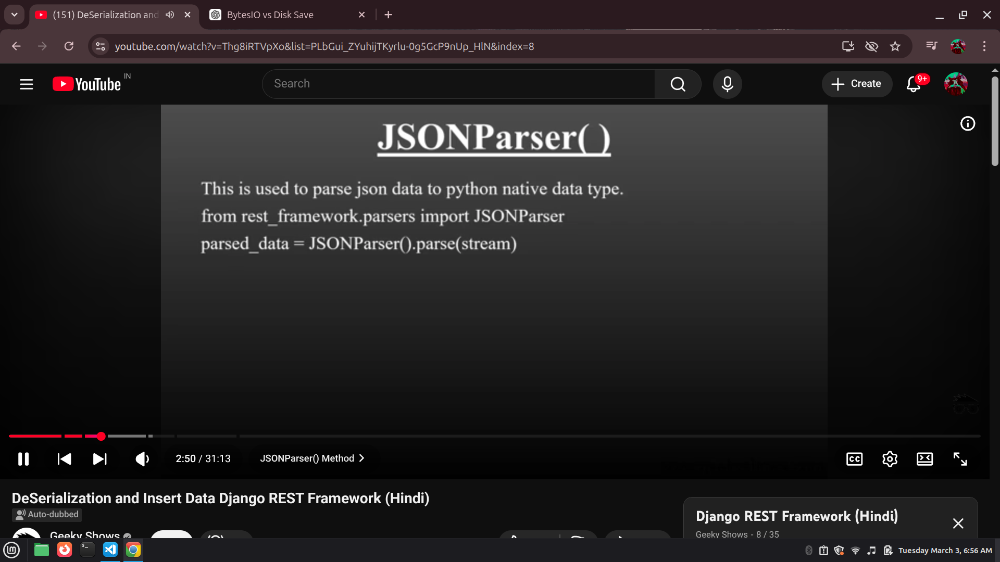

3 - steps for deserilization -- 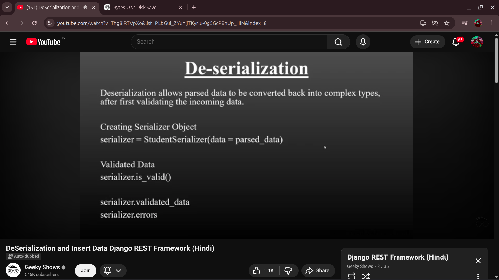

------

4 - 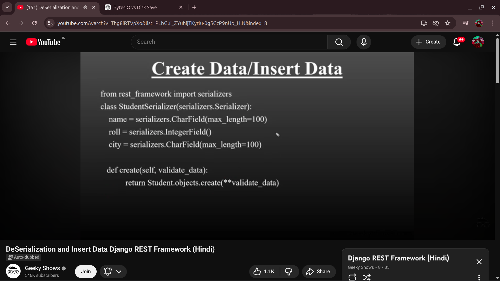

5 - 