In **Django REST Framework (DRF)** these two work together to build APIs faster.

---

## 1️⃣ GenericAPIView (Generic Base View)

**GenericAPIView** is a **base class view** that provides common functionality needed for APIs.

It **does not implement GET, POST, PUT, DELETE directly**.
It only provides **tools**.

Example tools it provides:

* `queryset`
* `serializer_class`
* `get_queryset()`
* `get_serializer()`
* `pagination`
* `filtering`

Example:

```python
from rest_framework.generics import GenericAPIView

class StudentView(GenericAPIView):
    queryset = Student.objects.all()
    serializer_class = StudentSerializer
```

But if you run this **nothing happens** because it has **no GET/POST logic**.

So:

> **GenericAPIView = base view that provides API tools but not CRUD operations.**

---

## 2️⃣ Mixins

**Mixins add specific CRUD behavior** to the view.

Each mixin provides **one operation**.

Examples:

| Mixin              | Work               |
| ------------------ | ------------------ |
| ListModelMixin     | GET all objects    |
| CreateModelMixin   | POST create object |
| RetrieveModelMixin | GET single object  |
| UpdateModelMixin   | PUT/PATCH update   |
| DestroyModelMixin  | DELETE object      |

Example:

```python
from rest_framework import mixins
from rest_framework.generics import GenericAPIView

class StudentView(mixins.ListModelMixin, GenericAPIView):
    queryset = Student.objects.all()
    serializer_class = StudentSerializer

    def get(self, request):
        return self.list(request)
```

Here:

* `ListModelMixin` → provides **list() method**
* `GenericAPIView` → provides **queryset + serializer**

So together they work.

---

## 3️⃣ Simple Analogy

Think like **car parts**.

* **GenericAPIView** → car engine (base structure)
* **Mixins** → features (brake, steering, gear)

When combined → full working car.

---

## 4️⃣ DRF already combines them

DRF provides ready-made classes like:

| Class             | Mixins Used                         |
| ----------------- | ----------------------------------- |
| ListAPIView       | GenericAPIView + ListModelMixin     |
| CreateAPIView     | GenericAPIView + CreateModelMixin   |
| RetrieveAPIView   | GenericAPIView + RetrieveModelMixin |
| ListCreateAPIView | List + Create                       |

Example:

```python
from rest_framework.generics import ListAPIView

class StudentList(ListAPIView):
    queryset = Student.objects.all()
    serializer_class = StudentSerializer
```

Now **GET works automatically**.

---

✅ **Very short summary**

* **GenericAPIView** → base view with tools (queryset, serializer)
* **Mixins** → add CRUD functionality
* **Generic Views** → combination of GenericAPIView + Mixins

---

If you're learning DRF step-by-step (like you said earlier), the **correct order is**:

```
FBV
↓
APIView
↓
GenericAPIView
↓
Mixins
↓
Concrete Generic Views
↓
ViewSets
```

If you want, I can also show **how DRF internally writes ListAPIView using mixins** (this clears the concept permanently).


1 -- 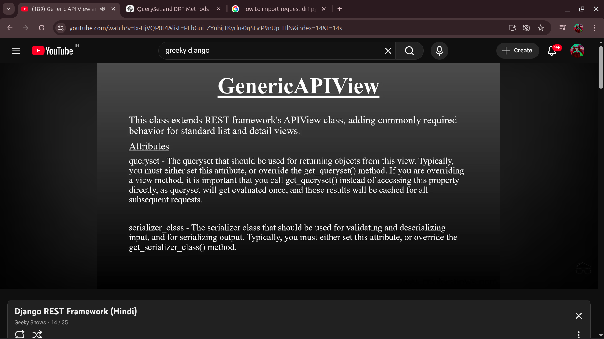

2 -- 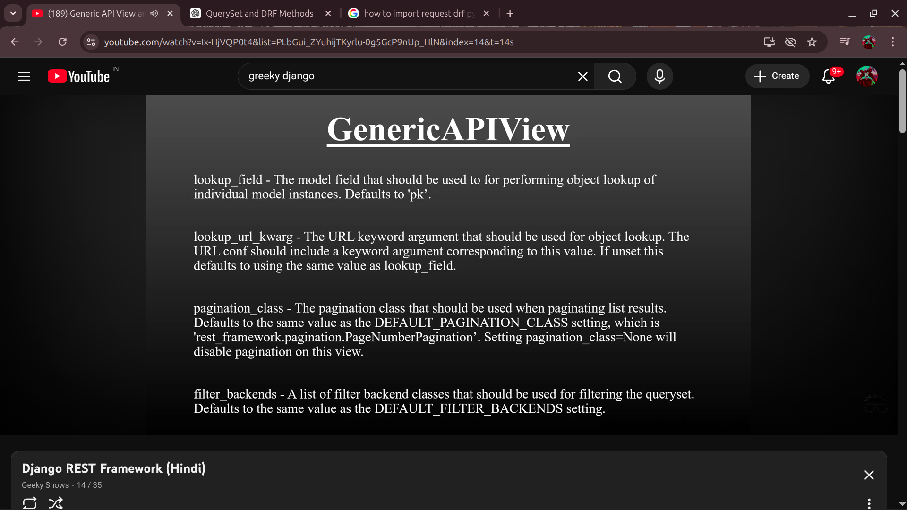

3 -- 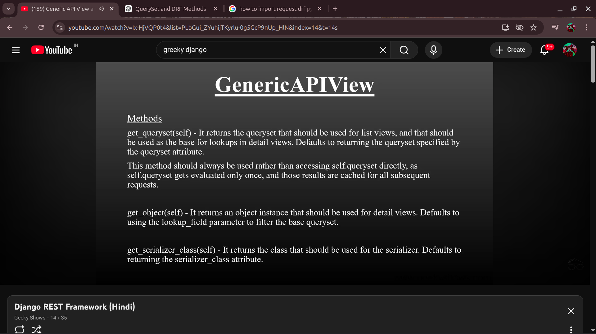

4 -- 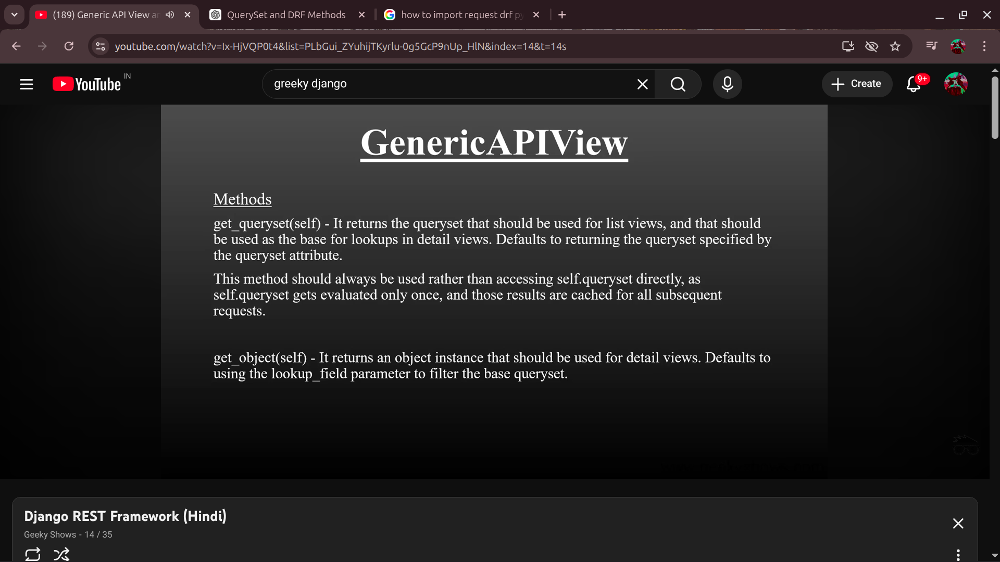

5 -- 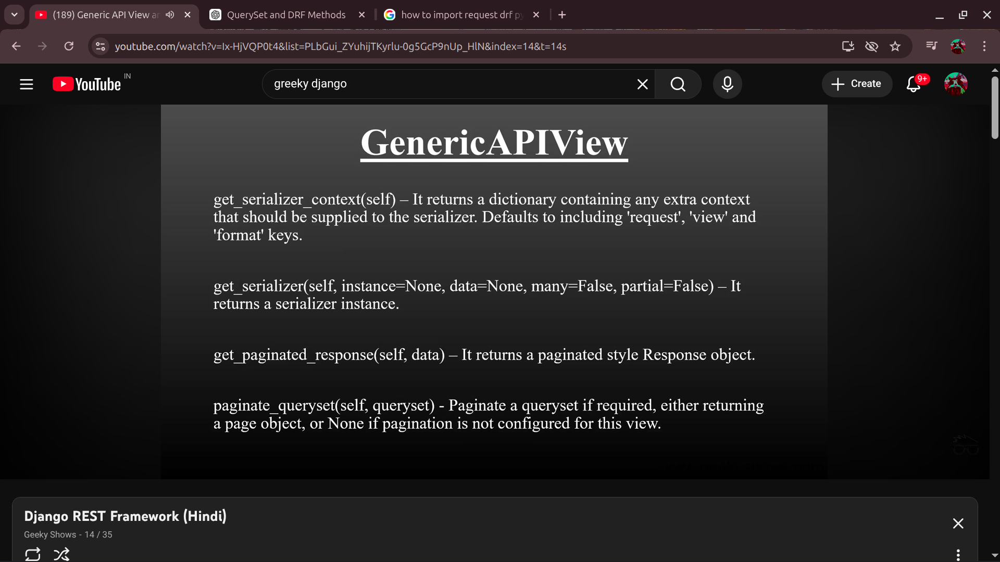

6 -- 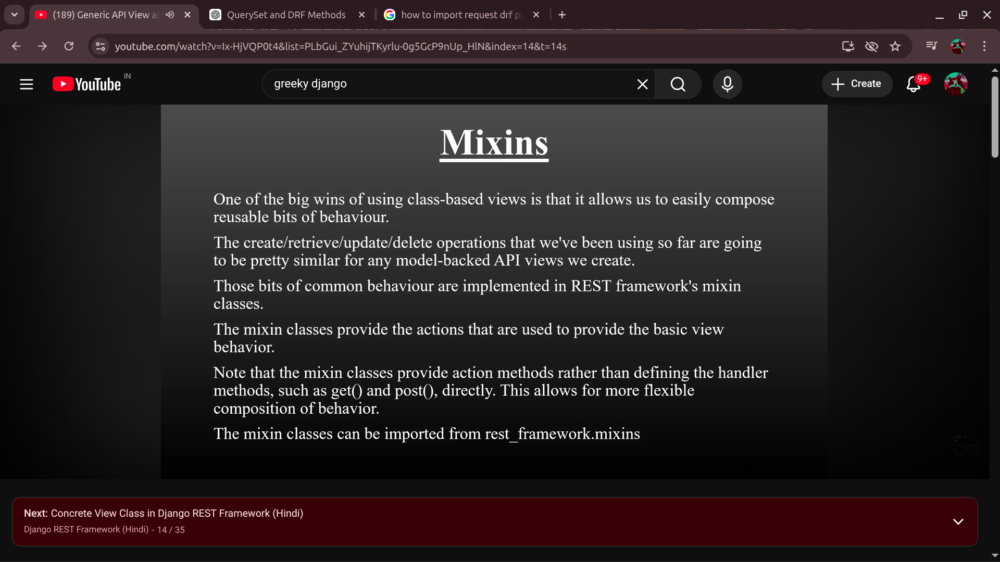

7 -- 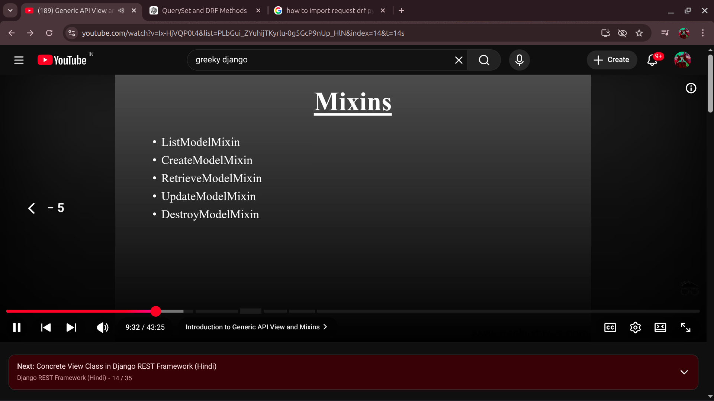


--- 


8 -- 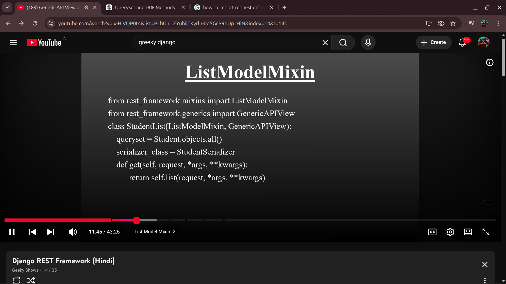

9 -- 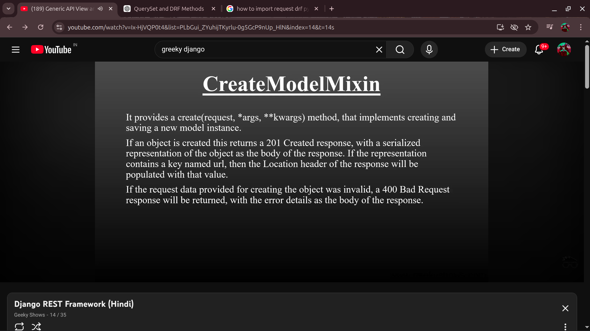

10 -- 

11 -- 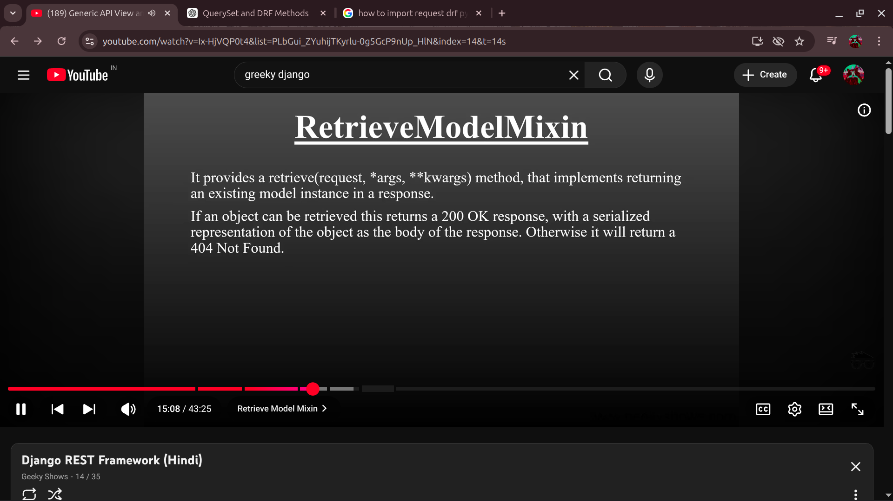

12 -- 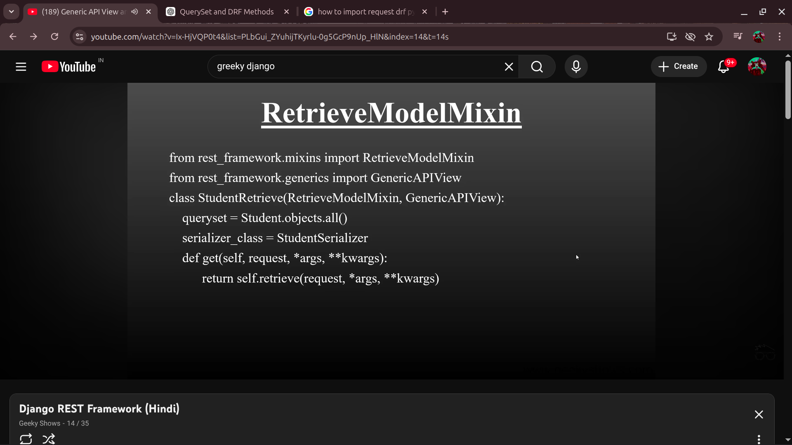

13 -- 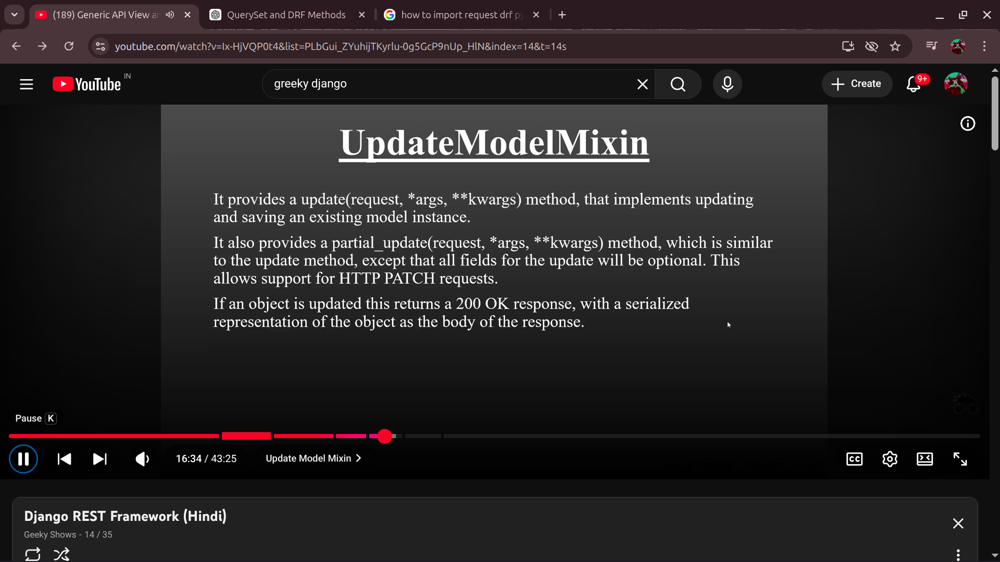

14 -- 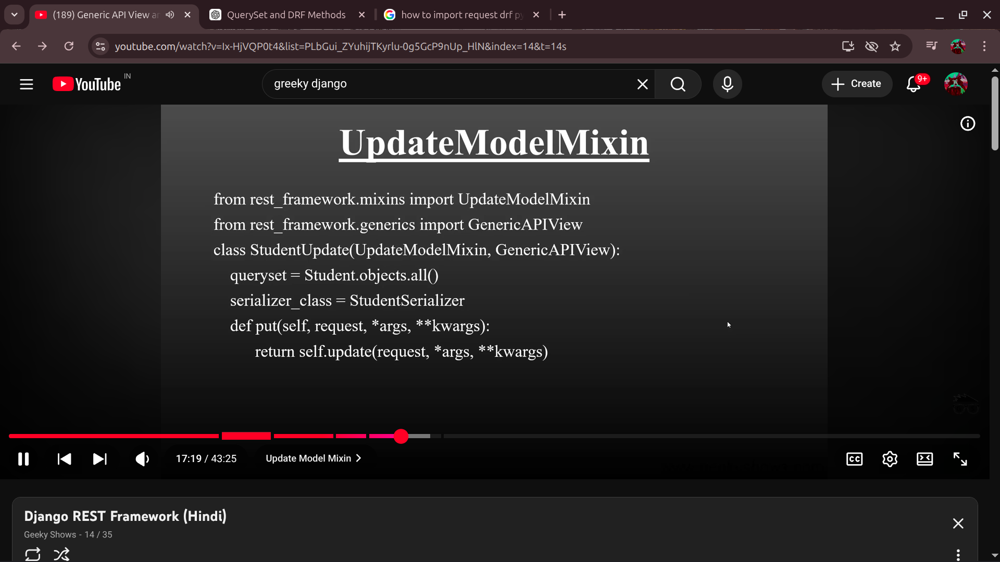

15 -- 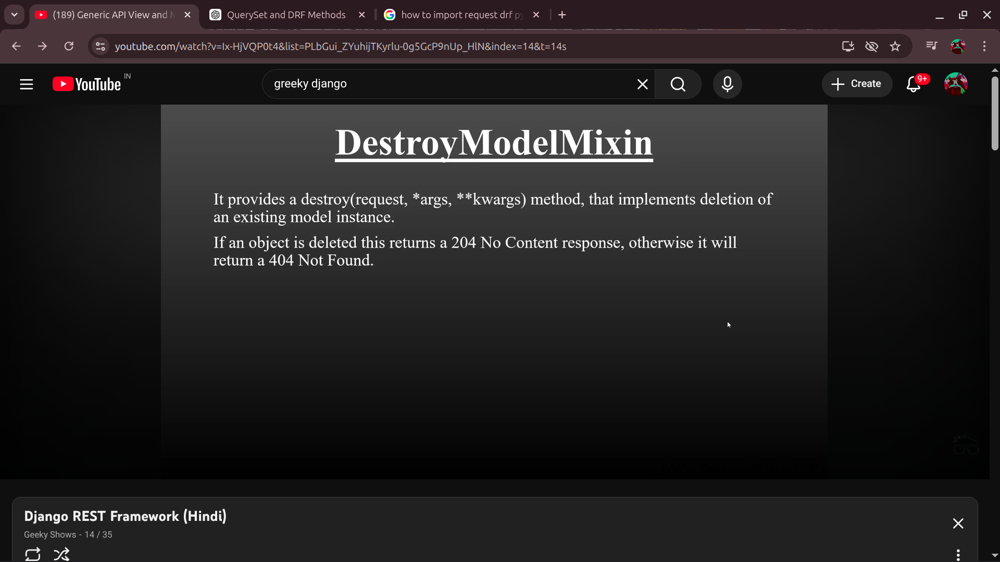

16 -- 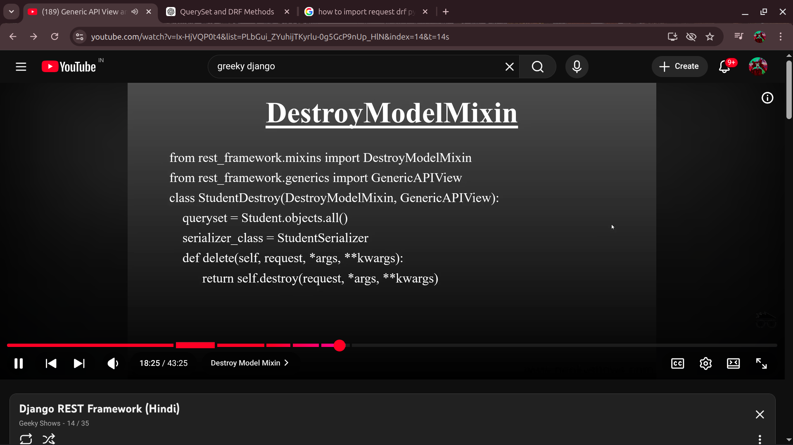

